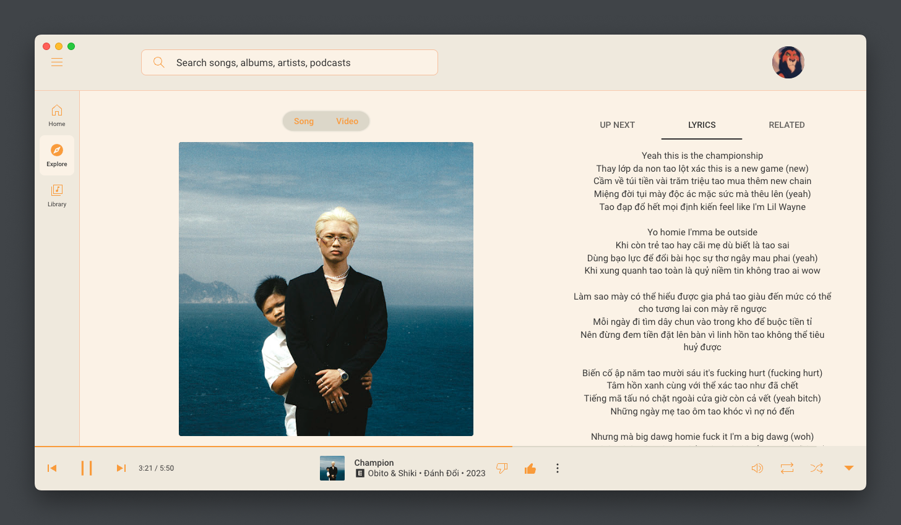
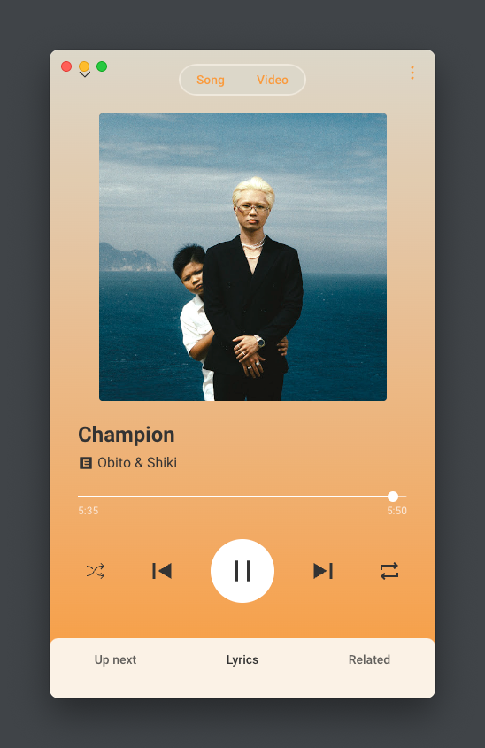

<h1 align="center">YouTube Music Theme</h1>

    
    

Feel better with your YouTube Music experience by using custom theme.

## Previews

1. Not Too Orange

🍊 It brings a more neutral look to the app, with a hint of orange. It's not too orange, not too dark like the default of YM.

## Usage

### For app users
- [YouTube Music Desktop App](https://github.com/th-ch/youtube-music)
YouTube Music Desktop App bundled with custom plugins:
    1. Create a new css file with one of the flavour imports below.
    2. Assuming you have the latest build with the theme selection menu, open the app, click `Options` > `Visual Tweaks` > `Theme` > `Import custom CSS file`, and choose the CSS file.
    3. You may need to refresh the app by `Reload App` (or even `Restart App`) to see the changes.
- [Youtube Music Desktop App (ytmdesktop)](https://github.com/ytmdesktop/ytmdesktop)
    1. Navigate to the settings of the Youtube Music Desktop App.
    2. Go to the appearances tab and turn on custom theme.
    3. Click on the pencil icon to open up the editor window.
    4. Copy and paste in the flavour's css file contents for your flavour and press the save button.

### For web users
- [Stylus](https://chrome.google.com/webstore/detail/stylus/clngdbkpkpeebahjckkjfobafhncgmne)
A user styles manager for web development

- [UserCSS](https://chromewebstore.google.com/detail/user-css/okpjlejfhacmgjkmknjhadmkdbcldfcb)
A quick and easy way to add custom CSS to the current web site.

## Customization
You can customize the theme by editing the CSS file or just clone content to a new one then modify it.

Learn how to use CSS here: [MDN Web Docs](https://developer.mozilla.org/en-US/docs/Web/CSS)

## Credits

I learned from [catppuccin/youtubemusic](https://github.com/catppuccin/youtubemusic) to build my own themes.